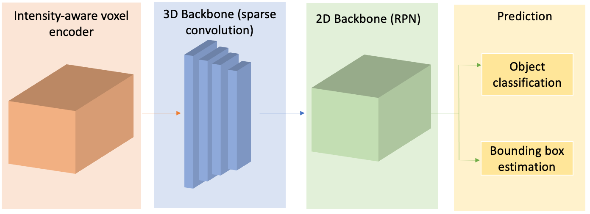
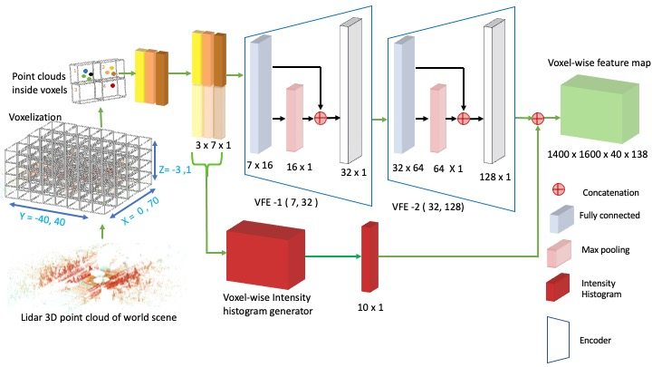

# IVEF
Lidar-Based Intensity-Aware Outdoor 3D Object Detection is centered on voxel-wise lidar Intensity historgram features. This intensity feature is contactinated with the geometric feature for robust feature map for the detection pipleline. 
The code is based on the [`[mmdetection3d]`](https:https://github.com/open-mmlab/mmdetection3d) framework. 
 


**LiDAR-Based Intensity-Aware Outdoor 3D Object Detection**


| |
|:--:|
| * 3D Detection Pipeline* |


| |
|:--:|
| * The Intensity-Based Voxel Feature Extractor* |


## Overview
- [IVEF](#ivef)
  - [Overview](#overview)
  - [Model Zoo](#model-zoo)
    - [KITTI 3D Object Detection Baselines](#kitti-3d-object-detection-baselines)
  - [Installation](#installation)
  - [Acknowledgement](#acknowledgement)
  - [Citation](#citation)


## Model Zoo

### KITTI 3D Object Detection Baselines
Selected supported methods are shown in the below table. The results are the 3D detection performance of Hard difficulty on the *val* set of KITTI dataset.
* The model is trained on 1 NVIDIA RTX 3080 GPU and PyTorch 1.9.0a0+c3d40fd.

|                                        Config | training time | Car@R40 | Pedestrian@R40 | Cyclist@R40  | log | download |
|---------------------------------------------|----------:|:-------:|:-------:|:-------:|:----:|:---------:|
| [Config](https://drive.google.com/file/d/1-07QAJD6pbLEoamdJpAywHnq2GlHcaYb/view?usp=drive_link) |~16 hours| 74.26 | 47.90 | 61.94 | [log](https://drive.google.com/file/d/1BgQC_ZFutrjtUi_2KHfMjHq1wIIHi9rO/view?usp=drive_link) | [model](https://drive.google.com/file/d/1fVKxGmT0unPrqBrOEXvmj39TRhLX6oud/view?usp=drive_link) |


## Installation
Please refer to [install.md](doc/install.md) for the installation of `Intensity-Based feature encoder`.

## Acknowledgement
We would like to thank the authors of[`[mmdetection3d]`](https:https://github.com/open-mmlab/mmdetection3d) for their open source release of their codebase.

## Citation
If you find this project useful in your research, please consider citing:
```
@book{naich2024lidar,
  title = {LiDAR-based intensity-aware outdoor 3D object detection},
  author = {Naich, Ammar Yasir and Carri{\'o}n, Jes{\'u}s Requena},
  journal = {Sensors},
  volume = {24},
  number = {9},
  pages = {2942},
  year = {2024},
  publisher = {MDPI},
}
```
